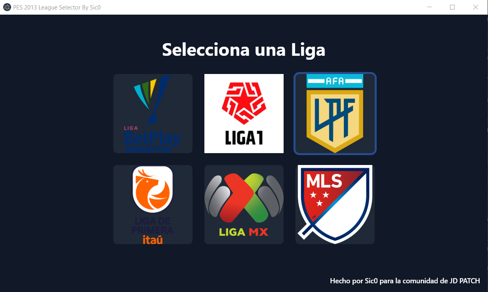

# Selector de Ligas - JD PATCH PES 2013

## Descripción

Esta aplicación es un selector de ligas diseñado específicamente para el parche **JD PATCH** de PES 2013. Permite seleccionar fácilmente la liga que deseas activar en el juego, actualizando automáticamente los archivos necesarios.

## Características

- Interfaz intuitiva para seleccionar ligas.
- Actualización automática del archivo `leagues-map.txt`.
- Compatible con las ligas incluidas en el parche JD PATCH.
- Diseñado para integrarse perfectamente con PES 2013.

## Capturas de Pantalla

### Pantalla Principal

  <!-- Reemplaza el enlace con la URL de la imagen -->
  

## Instalación

### Requisitos Previos

- Tener instalado el parche **JD PATCH** para PES 2013.
- Node.js y npm (o yarn) instalados en tu sistema.

## Licencia

Este proyecto está bajo la licencia [MIT](LICENSE).

## Créditos

- **Autor:** Sic0
- **Comunidad:** JD PATCH para PES 2013

  <strong>Hecho con ❤️ para la comunidad de JD PATCH</strong>

